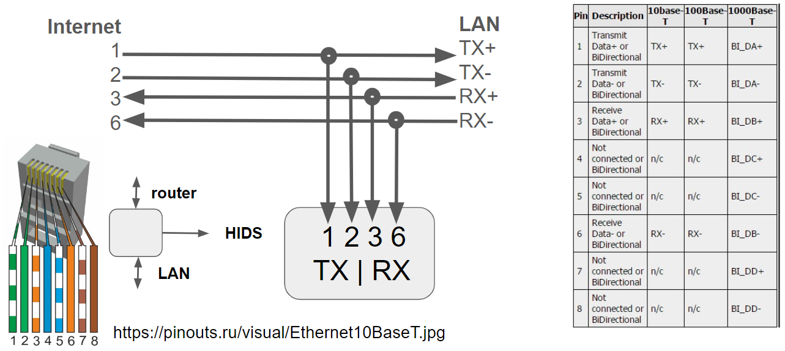

# homeFW
Home FW is a project that may be subject to several iteractions.
The target architecture is described in the following diagram:

The IPTV box is directly connected to the ISP router and everything else shall go through a firewall. After the firewall there will be a wiretap to an HIDS, and the traffic shall go transparently to the LAN switch.

## 1st iteration - RJ45 wire tap connected to a computer
This iteration of the project  holds several parts:
* RJ 45 Wire tap
* Suricata

### RJ 45 Wire tap
I've created the wire tap as described in the following diagram.

The end result is as in the pictures:

This wiretap is not compatible with gigabit, but up to the moment my switches and APs have ethernet ports limited to 100Mbps, so not an immediate issue.

### Suricata
...
### Results
```
(rpires㉿kali)-[~]
└─$ systemctl status suricata.service

● suricata.service - Suricata IDS/IDP daemon
     Loaded: loaded (/lib/systemd/system/suricata.service; enabled; preset: disabled)
     Active: active (running) since Wed 2023-11-08 19:06:57 GMT; 9s ago
       Docs: man:suricata(8)
             man:suricatasc(8)
             https://suricata-ids.org/docs/
    Process: 2887556 ExecStart=/usr/bin/suricata -D --af-packet -c /etc/suricata/suricata.yaml --pidfile /run/suricata.pid (code=exited, status=0/SUCCESS)
   Main PID: 2887557 (Suricata-Main)
      Tasks: 1 (limit: 14097)
     Memory: 297.4M
        CPU: 9.913s
     CGroup: /system.slice/suricata.service
             └─2887557 /usr/bin/suricata -D --af-packet -c /etc/suricata/suricata.yaml --pidfile /run/suricata.pid
                                                                                                                                                                                       
┌──(rpires㉿kali)-[~]
└─$ tail -f  /var/log/suricata/fast.log
11/08/2023-19:38:21.955683  [**] [1:2400000:3747] ET DROP Spamhaus DROP Listed Traffic Inbound group 1 [**] [Classification: Misc Attack] [Priority: 2] {TCP} 31.41.244.61:62034 -> 192.168.1.201:22
11/08/2023-19:38:21.955683  [**] [1:2525029:827] ET 3CORESec Poor Reputation IP group 30 [**] [Classification: Misc Attack] [Priority: 2] {TCP} 31.41.244.61:62034 -> 192.168.1.201:22
11/08/2023-19:43:31.043564  [**] [1:2402000:6769] ET DROP Dshield Block Listed Source group 1 [**] [Classification: Misc Attack] [Priority: 2] {TCP} 198.235.24.83:54461 -> 192.168.1.201:80
11/08/2023-23:41:58.601695  [**] [1:2400000:3747] ET DROP Spamhaus DROP Listed Traffic Inbound group 1 [**] [Classification: Misc Attack] [Priority: 2] {TCP} 31.41.244.62:42446 -> 192.168.1.201:22
11/09/2023-00:03:19.563792  [**] [1:2001219:20] ET SCAN Potential SSH Scan [**] [Classification: Attempted Information Leak] [Priority: 2] {TCP} 20.228.150.123:50336 -> 192.168.1.201:22
```
### Next
The data from Suricata must be available for logging and analysis. As a wishlist, the attackers should somehow be banned. How to do it?
The below example is one IP logging frequently.


## 2nd iteration - DNS filtering with Pi-Hole
This iteration of the project holds several parts:
* install PiHole in a RaspberyPi
* Configure DNS in the home APs

### PiHole
...
### configuring DNS
...
### Results
...
#### Good
...
#### Bad
...

## 3rd iteration - Detect Wifi attacks with Kismet
This iteration of the project is just about installing Kismet
### Kismet
...
### Results
...
#### Good
...
#### Bad
...

## 4th iteration - collect logs into Splunk
This iteration of the project holds several parts:
* install Splunk
* collect logs from local server
* collect logs from home ssh server
* push alarms to Slack
* push alarms to MQTT
* collect logs from home web server
### Splunk
...
### Splunk to Slack
...
In Splunk, configure the alert, add actions and select the "Slack" add-on, select the channel and configure the message:

I got the scheduled alarms in my Slack for mobile: 
.

However, the message is not populated as I expected. The link also fails because the link refers the machine local name.

...
### Splunk to MQTT
...
### collect logs from local server
...
### collect logs from home ssh server
Should be easy with the Splunk Universal forwarder, as explained here https://ethicalhackingguru.com/put-splunk-universal-forwarder-on-raspberry-pi/ or here https://community.splunk.com/t5/Getting-Data-In/Universal-Forwarder-on-Raspberry-Pi/m-p/58046. However, seems it is no longer supported. I've tried the officall versions available  at https://www.splunk.com/en_us/download/universal-forwarder.html, but they seemed not to work. Splunk also details how to install, but the link does not work at all: https://www.splunk.com/en_us/blog/industries/how-to-splunk-data-from-a-raspberry-pi-three-easy-steps.html.

So I've tried the solution with syslog. 

#### Syslog receiver in Splunk
...
#### Syslog sending from RPi to Splunk
Quite easy task, this is a good guide: https://rubysash.com/operating-system/linux/setup-rsyslog-client-forwarder-on-raspberry-pi/
Install rsyslog, and configure the IP of splunk:
```
sudo apt-get install rsyslog
sudo nano /etc/rsyslog.conf
...
auth,authpriv.*                 /var/log/auth.log
*.*;auth,authpriv.none          -/var/log/syslog
daemon.*                        -/var/log/daemon.log
kern.*                          -/var/log/kern.log
lpr.*                           -/var/log/lpr.log
mail.*                          -/var/log/mail.log
user.*                          -/var/log/user.log
...
*.* @@192.168.1.151
```
You can leave as default. The above link also provides easy ways to troubleshoot:
```
# service
sudo systemctl status rsyslog.service
# tcp dump
sudo tcpdump -nnei any port 514
tcpdump: verbose output suppressed, use -v or -vv for full protocol decode
listening on any, link-type LINUX_SLL (Linux cooked), capture size 262144 bytes
17:10:43.093791 Out dc:a6:32:40:1b:03 ethertype IPv4 (0x0800), length 157: 192.168.1.201.56700 > 192.168.1.151.514: Flags [P.], seq 2637753760:2637753849, ack 1880310178, win 502, options [nop,nop,TS val 2720338900 ecr 4067312830], length 89
17:10:43.101651  In 60:67:20:87:81:4c ethertype IPv4 (0x0800), length 68: 192.168.1.151.514 > 192.168.1.201.56700: Flags [.], ack 89, win 1641, options [nop,nop,TS val 4067317095 ecr 2720338900], length 0
# test message
logger -p daemon.emerg "DANGER WILL ROBINSON!!!"
```

#### Dashboard in Splunk
Created the new searches and saved to the RPI4 dashboard:
* city of the IP of the invalid usernames: source="tcp:514" "Invalid user"  | rex field=_raw "(?<src_ip>[[ipv4]])" | iplocation src_ip | stats count by City  | sort -count
* invalid usernames: source="tcp:514" "Invalid user"  | rex field=_raw "(?<src_ip>ipv4)"  | rex "(Invalid user )(?<InvUser>\w+)" | stats count by InvUser | sort -count
* failed authentiction: source="tcp:514" "authentication failure" "user=" | rex "(user=)(?<UnauthUser>\w+)" | stats count by UnauthUser | sort -count
And I was able to create a dashboard with ssh attacks to the RPi:


### collect logs from home web server
The lightttpd logs are stored in /var/log/lighttpd/access.log.
The logs have the data:
```
87.196.80.1 g0mesp1res.dynip.sapo.pt - [29/Sep/2023:00:38:49 +0100] "GET /phishing/jquery.min.js HTTP/1.1" 200 282766 "http://g0mesp1res.dynip.sapo.pt/phishing/phishing.html" "Mozilla/5.0 (Linux; Android 10; K) AppleWebKit/537.36 (KHTML, like Gecko) Chrome/117.0.0.0 Mobile Safari/537.36"
87.196.80.1 g0mesp1res.dynip.sapo.pt - [29/Sep/2023:00:38:49 +0100] "GET /phishing/favicon.ico HTTP/1.1" 404 341 "http://g0mesp1res.dynip.sapo.pt/phishing/phishing.html" "Mozilla/5.0 (Linux; Android 10; K) AppleWebKit/537.36 (KHTML, like Gecko) Chrome/117.0.0.0 Mobile Safari/537.36"
87.196.80.1 g0mesp1res.dynip.sapo.pt - [29/Sep/2023:00:38:53 +0100] "GET /stats/rf433.txt HTTP/1.1" 200 5959 "http://g0mesp1res.dynip.sapo.pt/" "Mozilla/5.0 (Linux; Android 10; K) AppleWebKit/537.36 (KHTML, like Gecko) Chrome/117.0.0.0 Mobile Safari/537.36"
```
The data may be useful:
 * IP of the requestor
 * destination
 * errors / successes
 * method
 * requestor system

Let's try to send it to splunk via syslog:
WRONG!!!!
```
sudo nano /etc/rsyslog.conf
...
lightttpd.*                 /var/log/lighttpd/access.log

sudo systemctl restart rsyslog
```

##  5th iteration - reduce ssh attacks with fail2ban
fail2ban is a simple tool that by analyzing logs, discovers repeated failed authentication attempts and automatically sets firewall rules to drop traffic originating from the offender’s IP address.
More info here: https://blog.swmansion.com/limiting-failed-ssh-login-attempts-with-fail2ban-7da15a2313b
### fail2ban
Install and use the default config: ```sudo apt install fail2ban```
Checking installation:
```
sudo fail2ban-client status sshd
Status for the jail: sshd
|- Filter
|  |- Currently failed: 12
|  |- Total failed:     2443
|  `- File list:        /var/log/auth.log
`- Actions
   |- Currently banned: 7
   |- Total banned:     386
   `- Banned IP list:   194.93.25.163 103.179.57.150 161.230.84.140 190.35.38.231 186.230.74.198 85.215.34.119 64.226.120.7
```
```
sudo iptables -L -n -v
Chain f2b-sshd (1 references)
 pkts bytes target     prot opt in     out     source               destination
   20  1616 REJECT     all  --  *      *       64.226.120.7         0.0.0.0/0            reject-with icmp-port-unreachable
   21  1668 REJECT     all  --  *      *       85.215.34.119        0.0.0.0/0            reject-with icmp-port-unreachable
   17  1272 REJECT     all  --  *      *       186.230.74.198       0.0.0.0/0            reject-with icmp-port-unreachable
   16  1236 REJECT     all  --  *      *       190.35.38.231        0.0.0.0/0            reject-with icmp-port-unreachable
   26  1960 REJECT     all  --  *      *       161.230.84.140       0.0.0.0/0            reject-with icmp-port-unreachable
   27  1980 REJECT     all  --  *      *       103.179.57.150       0.0.0.0/0            reject-with icmp-port-unreachable
   26  2012 REJECT     all  --  *      *       194.93.25.163        0.0.0.0/0            reject-with icmp-port-unreachable
   19  1392 REJECT     all  --  *      *       209.45.73.18         0.0.0.0/0            reject-with icmp-port-unreachable
   23  1740 REJECT     all  --  *      *       43.159.45.214        0.0.0.0/0            reject-with icmp-port-unreachable
10615 1609K RETURN     all  --  *      *       0.0.0.0/0            0.0.0.0/0
```
After a few days, I tried checking how many IPs were being rejected and the list was over 600:
```
sudo iptables -L -n -v | grep REJECT | wc -l
653
```

## 6th iteration - remaining weaknesses
One idea would be to report the IPs of fail2ban such as using the https://www.abuseipdb.com/

### Externally exposed nmap scan
An initial step is to check what an external adversary can see when accessing my ISP router.
```
sudo nmap -sV <my server>
PORT     STATE SERVICE     VERSION
21/tcp   open  ftp         D-Link/Comtrend DSL modem ftp firmware update
22/tcp   open  ssh         Dropbear sshd 2017.75 (protocol 2.0)
23/tcp   open  telnet
80/tcp   open  http        lighttpd 1.4.53
139/tcp  open  netbios-ssn Samba smbd 3.X - 4.X (workgroup: WORKGROUP)
443/tcp  open  tcpwrapped
445/tcp  open  netbios-ssn Samba smbd 3.X - 4.X (workgroup: WORKGROUP)
1883/tcp open  mqtt
2222/tcp open  ssh         OpenSSH 7.9p1 Raspbian 10+deb10u2+rpt1 (protocol 2.0)
5060/tcp open  sip         PTInS GR241AG Build 3RGW040C01r003 (Status: 404 Not Found)
8080/tcp open  http-proxy?
8089/tcp open  unknown
9876/tcp open  sd?
9877/tcp open  unknown
```
##### ftp, ssh, telnet, ...  open?
This is the router itself, as configured by my ISP. Is it well protected?
#### 2222/tcp open  ssh         OpenSSH 7.9p1 Raspbian 10+deb10u2+rpt1 (protocol 2.0)
This is the port forwarding to my raspberry ssh server. How secure is it? Do I need it? Maybe better close it!
#### 80/tcp   open  http        lighttpd 1.4.53
This is the port forwarding to my raspberry web server. How secure is it? Maybe I should make some effort and use only https
#### 1883/tcp open  mqtt
This is the port forwarding to my mosquitto server. How secure is it? How can I improve its security

