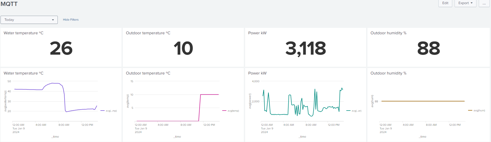

# homeFW
Home FW is a project that may be subject to several iteractions.
The target architecture is described in the following diagram:


The IPTV box is directly connected to the ISP router and everything else shall go through a firewall. After the firewall there will be a wiretap to an HIDS, and the traffic shall go transparently to the LAN switch.

In my LAN I have 3 main services with port forwarding defined in the ISP router:
* a Web server, running in a raspberry PI
* a SSH server, also running in the same raspberry PI
* a MQTT server, also running in the same raspberry PI
I also have a Kali machine collecting some logs, that I will describe along this doc. I hope to later move this the same raspberry Pi, or other one.
```sudo lsof -i -P -n | grep LISTEN
sshd                root      IPv4    19214      0t0  TCP *:22 (LISTEN)
mosquitto      mosquitto      IPv4    19220      0t0  TCP *:1883 (LISTEN)
pihole-FT         pihole      IPv4    50260      0t0  TCP *:53 (LISTEN)
lighttpd        www-data      IPv4    21845      0t0  TCP *:80 (LISTEN)
```
Note, the DNS service is internal only, not included  in the router port-forwarding.

So, the current status is as described in the following pic:


## 1st iteration - RJ45 wire tap connected to a computer
This iteration of the project  holds several parts:
* RJ 45 Wire tap
* Suricata

### RJ 45 Wire tap
I've created the wire tap as described in the following diagram.


The end result is as in the pictures:


This wiretap is not compatible with gigabit, but up to the moment my switches and APs have ethernet ports limited to 100Mbps, so not an immediate issue.

### Suricata
https://suricata.io/ is a  high performance, open source network analysis and threat detection software used by most private and public organizations, and embedded by major vendors to protect their assets.
Suricata has a package ready to install and runs as a service:
```sudo systemctl start suricata```

I’ve installed, copied the rules (some tweaks needed) and tweaked the configuration in:
```/etc/suricata/suricata.yaml```

The logs are in e.g.:
```/var/log/suricata/fast.log```

#### Testing
```
curl -A "BlackSun" www.google.com
curl -A Blacksun http://example.com 
curl https://testmyids.com
```
note, in this test I reverted the dip-switch to the outbound but cań't see any result!
Note: this works fine for testing outgoing: curl http://testmynids.org/uid/index.html


### Results
I am only interested in the packets coming from the Internet, so the dip-switch is always in the inbound position.
The below lines are an excerpt of a few minutes of operation.
```
(rpires㉿kali)-[~]
└─$ systemctl status suricata.service

● suricata.service - Suricata IDS/IDP daemon
     Loaded: loaded (/lib/systemd/system/suricata.service; enabled; preset: disabled)
     Active: active (running) since Wed 2023-11-08 19:06:57 GMT; 9s ago
       Docs: man:suricata(8)
             man:suricatasc(8)
             https://suricata-ids.org/docs/
    Process: 2887556 ExecStart=/usr/bin/suricata -D --af-packet -c /etc/suricata/suricata.yaml --pidfile /run/suricata.pid (code=exited, status=0/SUCCESS)
   Main PID: 2887557 (Suricata-Main)
      Tasks: 1 (limit: 14097)
     Memory: 297.4M
        CPU: 9.913s
     CGroup: /system.slice/suricata.service
             └─2887557 /usr/bin/suricata -D --af-packet -c /etc/suricata/suricata.yaml --pidfile /run/suricata.pid
                                                                                                                                                                                       
┌──(rpires㉿kali)-[~]
└─$ tail -f  /var/log/suricata/fast.log
11/08/2023-19:38:21.955683  [**] [1:2400000:3747] ET DROP Spamhaus DROP Listed Traffic Inbound group 1 [**] [Classification: Misc Attack] [Priority: 2] {TCP} 31.41.244.61:62034 -> 192.168.1.201:22
11/08/2023-19:38:21.955683  [**] [1:2525029:827] ET 3CORESec Poor Reputation IP group 30 [**] [Classification: Misc Attack] [Priority: 2] {TCP} 31.41.244.61:62034 -> 192.168.1.201:22
11/08/2023-19:43:31.043564  [**] [1:2402000:6769] ET DROP Dshield Block Listed Source group 1 [**] [Classification: Misc Attack] [Priority: 2] {TCP} 198.235.24.83:54461 -> 192.168.1.201:80
11/08/2023-23:41:58.601695  [**] [1:2400000:3747] ET DROP Spamhaus DROP Listed Traffic Inbound group 1 [**] [Classification: Misc Attack] [Priority: 2] {TCP} 31.41.244.62:42446 -> 192.168.1.201:22
11/09/2023-00:03:19.563792  [**] [1:2001219:20] ET SCAN Potential SSH Scan [**] [Classification: Attempted Information Leak] [Priority: 2] {TCP} 20.228.150.123:50336 -> 192.168.1.201:22
```
### Next
The data from Suricata must be available for logging and analysis. As a wishlist, the attackers should somehow be banned. How to do it?
The below example is one IP captured frequently.


## 2nd iteration - DNS filtering with Pi-Hole
This iteration of the project holds several parts:
* install PiHole in a RaspberyPi
* Configure DNS in the home APs

### PiHole
Installed from https://pi-hole.net/.
```git clone --depth 1 https://github.com/pi-hole/pi-hole.git Pi-hole
cd "Pi-hole/automated install/"
sudo bash basic-install.sh
```
change password with pihole -a -p

I've stopped apache2 and so all services are now on lightppd.
Pihole now listens to udp/53 and has a service in tcp/80.
```sudo lsof -i -P -n | grep LISTEN
lighttpd       www-data      IPv4    21845      0t0  TCP *:80 (LISTEN)

pihole status
  [✓] FTL is listening on port 53
     [✓] UDP (IPv4)
     [✓] TCP (IPv4)
     [✓] UDP (IPv6)
     [✓] TCP (IPv6)

  [✓] Pi-hole blocking is enabled
```
Pihole provides a useful dashboard:


### configuring DNS
Leaved it up to google and made sure the Pihole would only answer to internal requests. The DHCP servers running in my LAN now point to this PiHole as the DNS. 
This DNS server does not reply to external queries which could be abused. If it woud be replying to external queries, it would be queried with spoofed source IPs, so it woud answer to the target of a DDoS victim.


## 3rd iteration - Detect Wifi attacks with Kismet
This iteration of the project is just about installing Kismet.
### Kismet
As easy as installing the interface libs, and clone from git, as described in https://www.kismetwireless.net/docs/readme/installing/linux/

Start the service with 
```
systemctl start kismet.
Nov 12 22:27:35 kali kismet[430726]: INFO: Opened kismetdb log file './/Kismet-20231112-22-27-35-1.kismet'
```
Open the GUI with http://localhost:2501/ and select and enable the source. I've used one additional usb wifi adapter:


Logs are configured at /etc/kismet/kismet_logging.conf
```
enable_logging=true
log_prefix=/tmp
log_types=kismet,wiglecsv
```

```
tail -f /Kismet-20231112-22-27-35-1.kismet 
K?IEEE802.11AC:15:A2:95:57:D3FF:FF:FF:FF:FF:FF00:00:00:00:00:00$??0p?5FE308BD-0000-0000-0000-38A28C90606C.Hl    ?b????????/????W???=`/b&W?????V?d{?|?=#?        ?d????[?@x?z5???
eQT??G  ?Q??s?R=?*??BUD///
```
This is not a readable format but rather a format for SQL, explained here https://www.kismetwireless.net/docs/readme/logging/logging/
Notice these logs grow to hundred of MB per day.

This log seems to do not get any data.
```
tail -f Kismet-20231112-23-05-34-1.wiglecsv
WigleWifi-1.4,appRelease=Kismet202208R1,model=Kismet,release=2022.08.R1,device=kismet,display=kismet,board=kismet,brand=kismet
MAC,SSID,AuthMode,FirstSeen,Channel,RSSI,CurrentLatitude,CurrentLongitude,AltitudeMeters,AccuracyMeters,Type
```


The objectives are to get similar info in log as to what we have in the GUI, and thus create some dashboards and alerts with:
* list of visible SSIDs
* list of devices
* list of alerts


## 4th iteration - collect logs into Splunk
This iteration of the project holds several parts:
* install Splunk
* collect logs from local server
* collect logs from home ssh server
* push alarms to Slack
* push alarms to MQTT
* collect logs from home web server
  
### install Splunk
Easy to install in my Kali linux, just followed the link https://docs.splunk.com/Documentation/Splunk/9.1.1/SearchTutorial/InstallSplunk#Linux_installation_instructions and then start the application with ```sudo /opt/splunk/bin/splunk start```. The web application gets available in http://localhost:8000/.


### collect logs from local machine
Add the files to be monitored here: http://192.168.1.151:8000/en-US/manager/search/data/inputs/monitor


**From Kali authentication:**
KALI Invalid logins daily, last month: sourcetype=KaliAuthLog AND "invalid" | rex field=_raw "(?<clientip>[[ipv4]])" | timechart count

**From Suricata:**
* SURICATA attacls per ports, last week: source="/var/log/suricata/fast.log" AND "Attack" | top limit=10 dest_port
* SURICATA attacks per IP, city and country, last month: source="/var/log/suricata/fast.log" AND "Attack" | stats count by src_ip  |iplocation src_ip | sort -count | table src_ip count City Country
* SURICATA alert events, last week: source="/var/log/suricata/eve.json" AND "e" event_type=alert | timechart count
* SURICATA attacks per country in map, last month: source="/var/log/suricata/fast.log" AND "Attack" |iplocation src_ip | stats count by Country |geom geo_countries allFeatures=True featureIdField=Country
* SURICATA attacks per ports, time series, last week: source="/var/log/suricata/fast.log" AND "Attack" AND (dest_port=80 OR dest_port=22 OR dest_port=1883)  | timechart count by dest_port

### collect logs from home ssh server
Should be easy with the Splunk Universal forwarder, as explained here https://ethicalhackingguru.com/put-splunk-universal-forwarder-on-raspberry-pi/ or here https://community.splunk.com/t5/Getting-Data-In/Universal-Forwarder-on-Raspberry-Pi/m-p/58046. However, seems it is no longer supported. I've tried the officall versions available  at https://www.splunk.com/en_us/download/universal-forwarder.html, but they seemed not to work. Splunk also details how to install, but the link does not work at all: https://www.splunk.com/en_us/blog/industries/how-to-splunk-data-from-a-raspberry-pi-three-easy-steps.html.

So I've tried the solution with syslog. 

#### Syslog receiver in Splunk
Configured here: http://192.168.1.151:8000/en-US/manager/search/data/inputs/tcp/raw
TCP port	     514	
Source type	linux_messages_syslog

http://192.168.1.151:8000/en-US/manager/search/data/inputs/monitor

#### Syslog sending from RPi to Splunk
Quite easy task, this is a good guide: https://rubysash.com/operating-system/linux/setup-rsyslog-client-forwarder-on-raspberry-pi/
Install rsyslog, and configure the IP of splunk:
```
sudo apt-get install rsyslog
sudo nano /etc/rsyslog.conf
...
auth,authpriv.*                 /var/log/auth.log
*.*;auth,authpriv.none          -/var/log/syslog
daemon.*                        -/var/log/daemon.log
kern.*                          -/var/log/kern.log
lpr.*                           -/var/log/lpr.log
mail.*                          -/var/log/mail.log
user.*                          -/var/log/user.log
...
*.* @@192.168.1.151
```
You can leave as default. The above link also provides easy ways to troubleshoot:
```
# service
sudo systemctl status rsyslog.service
# tcp dump
sudo tcpdump -nnei any port 514
tcpdump: verbose output suppressed, use -v or -vv for full protocol decode
listening on any, link-type LINUX_SLL (Linux cooked), capture size 262144 bytes
17:10:43.093791 Out dc:a6:32:40:1b:03 ethertype IPv4 (0x0800), length 157: 192.168.1.201.56700 > 192.168.1.151.514: Flags [P.], seq 2637753760:2637753849, ack 1880310178, win 502, options [nop,nop,TS val 2720338900 ecr 4067312830], length 89
17:10:43.101651  In 60:67:20:87:81:4c ethertype IPv4 (0x0800), length 68: 192.168.1.151.514 > 192.168.1.201.56700: Flags [.], ack 89, win 1641, options [nop,nop,TS val 4067317095 ecr 2720338900], length 0
# test message
logger -p daemon.emerg "DANGER WILL ROBINSON!!!"
```

#### Dashboards in Splunk
Created the new searches and saved to the RPI4 dashboard:
* RPI4 SSH auth failures per day: source="tcp:514" "authentication failure" "user=" | timechart count
* RPI4 SSH auth failures username: source="tcp:514" "authentication failure" "user=" | rex "(user=)(?<UnauthUser>\w+)" | stats count by UnauthUser | sort -count
* RPI4 SSH invalid users per day: source="tcp:514" "Invalid user" | timechart count
* RPI4 SSH invalid users per Country last week: source="tcp:514" "Invalid user"  | rex field=_raw "(?<src_ip>[[ipv4]])" | iplocation src_ip | stats count by Country | sort - count
* RPI4 SSH invalid users per city last day: * source="tcp:514" "Invalid user"  | rex field=_raw "(?<src_ip>[[ipv4]])" | iplocation src_ip | stats count by City | sort - count
And I was able to create a dashboard with ssh attacks to the RPi:


And this dashboard for Kali, with Suricata data:


### collect logs from home web server
The lightttpd logs are stored in /var/log/lighttpd/access.log.
The logs have the data:
```
87.196.80.1 g0mesp1res.dynip.sapo.pt - [29/Sep/2023:00:38:49 +0100] "GET /phishing/jquery.min.js HTTP/1.1" 200 282766 "http://g0mesp1res.dynip.sapo.pt/phishing/phishing.html" "Mozilla/5.0 (Linux; Android 10; K) AppleWebKit/537.36 (KHTML, like Gecko) Chrome/117.0.0.0 Mobile Safari/537.36"
87.196.80.1 g0mesp1res.dynip.sapo.pt - [29/Sep/2023:00:38:49 +0100] "GET /phishing/favicon.ico HTTP/1.1" 404 341 "http://g0mesp1res.dynip.sapo.pt/phishing/phishing.html" "Mozilla/5.0 (Linux; Android 10; K) AppleWebKit/537.36 (KHTML, like Gecko) Chrome/117.0.0.0 Mobile Safari/537.36"
87.196.80.1 g0mesp1res.dynip.sapo.pt - [29/Sep/2023:00:38:53 +0100] "GET /stats/rf433.txt HTTP/1.1" 200 5959 "http://g0mesp1res.dynip.sapo.pt/" "Mozilla/5.0 (Linux; Android 10; K) AppleWebKit/537.36 (KHTML, like Gecko) Chrome/117.0.0.0 Mobile Safari/537.36"
```
The data may be useful:
 * IP of the requestor
 * destination
 * errors / successes
 * method
 * requestor system

Let's try to send it to splunk via syslog:
WRONG!!!!
```
sudo nano /etc/rsyslog.conf
...
lightttpd.*                 /var/log/lighttpd/access.log

sudo systemctl restart rsyslog
```

### Push Splunk alarms to Slack
In Splunk, configure the alert, add actions and select the "Slack" add-on, select the channel and configure the message:


I scheduled alarms in my Slack for mobile: 

.

However, the message is not populated as I expected. The link also fails because the link refers the machine local name.

**Not working anymore as the trial licensed expired.**

### Splunk to MQTT
**Not possible anymore as the trial licensed expired.**

### Splunk not working anymore as the free license is not enough for all use cases:**
```Error in 'rtlitsearch' command: Your Splunk license expired or you have exceeded your license limit too many times. Renew your Splunk license by visiting www.splunk.com/store or calling 866.GET.SPLUNK```


So, I've changed the license to the free license, and restarted splunk.


Then found that the indexers are indexing too fast and getting too big. In http://192.168.1.151:8000/en-US/manager/search/data/indexes confirmed the main db was at 4.58GB after 2 months.
Copied the default indexer from /opt/splunk/etc/system/default/indexes.conf to /opt/splunk/etc/system/local/indexes.conf  and reduced some parameters:
- maxTotalDataSizeMB = 5000

Again restarted splunk with ```sudo /opt/splunk/bin/splunk restart```. When going back to http://192.168.1.151:8000/en-US/manager/search/data/indexes, I could confirme the Maz Size at 4.88GB.

Now, to check what am I abusing, looked into http://192.168.1.151:8000/en-US/manager/search/licenseusage. I notice splunk is collecting 150MB of data daily, under the 500MB free license daily limit as stated in http://192.168.1.151:8000/en-US/manager/search/licenseusage. However there is this notification: ```1 pool warning reported by 1 indexer```.

### Collect logs from other Linux machines
* Installed the Universal Splunk receiver from https://www.splunk.com/en_us/download/universal-forwarder.html
* Used the wget option wget -O splunkforwarder-9.1.2-b6b9c8185839-linux-2.6-amd64.deb "https://download.splunk.com/products/universalforwarder/releases/9.1.2/linux/splunkforwarder-9.1.2-b6b9c8185839-linux-2.6-amd64.deb"
* start the firwarder https://docs.splunk.com/Documentation/Forwarder/9.1.2/Forwarder/StartorStoptheuniversalforwarder
* Configured the splunk to receive in port 9997, as explained here https://docs.splunk.com/Documentation/Forwarder/8.2.6/Forwarder/Enableareceiver 

Not happy with the above, I created a script to collect CPU, MEM and HDD, and sent it via syslog. The initial script was not good, but Rodrigo helped and simplified in one single line:
systemstats.sh
```
echo "DATE=`date -u +"%Y.%m.%d %T"`, CPU=`LC_ALL=C top -bn1 | grep "Cpu(s)" | sed "s/.*, *\([0-9.]*\)%* id.*/\1/" | awk '{print 100 - $1}'`%, RAM=`free -m | awk '/Mem:/ { printf("%3.1f%%", $3/$2*100) }'`, HDD=`df -h / | awk '/\// {print $(NF-1)}'`"

and specifically for the raspberry, including temperature:
echo "DATE=`date -u +"%Y.%m.%d %T"`, CPU=`LC_ALL=C top -bn1 | grep "Cpu(s)" | sed "s/.*, *\([0-9.]*\)%* id.*/\1/" | awk '{print 100 - $1}'`%, RAM=`free -m | awk '/Mem:/ { printf("%3.1f%%", $3/$2*100) }'`, HDD=`df -h / | awk '/\// {print $(NF-1)}', TEMP=`vcgencmd measure_temp | awk -F "=" '{print $2}' | awk -F "'" '{print $1}'`%"
```
Install the rsyslog with sudo apt-get install rsyslog
sudo nano /etc/rsyslog.d/systemstats.conf
```
module(load="imfile" PollingInterval="1") #needs to be done just once
input(type="imfile"
      File="/home/rpires/systemstats.log"
      Tag="systemstats"
      Facility="local0")
```

crontab -e
```
*/1 * * * * sh /home/rpires/systemstats.sh >> /home/rpires/systemstats.log
```

sudo nano /etc/rsyslog.conf
```
*.* @@192.168.1.200
```

Splunk:
```
source="tcp:514" "systemstats DATE" host=rpi2 | timechart avg(CPU) avg(RAM) avg(HDD)
```
**Note: the CPU of RaspberryPi 2 gets to 100% everytime the crontab runs.**
**Note: in Kali, probably due to security concerns, I was not able to have rsyslog collecing the log from my own folder. So, I created the log in /var/log, and for that I used sudo crontab.**

##  5th iteration - reduce ssh attacks with fail2ban
fail2ban is a simple tool that by analyzing logs, discovers repeated failed authentication attempts and automatically sets firewall rules to drop traffic originating from the offender’s IP address.
More info here: https://blog.swmansion.com/limiting-failed-ssh-login-attempts-with-fail2ban-7da15a2313b
### fail2ban
Install and use the default config: ```sudo apt install fail2ban```
Checking installation:
```
sudo fail2ban-client status sshd
Status for the jail: sshd
|- Filter
|  |- Currently failed: 12
|  |- Total failed:     2443
|  `- File list:        /var/log/auth.log
`- Actions
   |- Currently banned: 7
   |- Total banned:     386
   `- Banned IP list:   194.93.25.163 103.179.57.150 161.230.84.140 190.35.38.231 186.230.74.198 85.215.34.119 64.226.120.7
```
```
sudo iptables -L -n -v
Chain f2b-sshd (1 references)
 pkts bytes target     prot opt in     out     source               destination
   20  1616 REJECT     all  --  *      *       64.226.120.7         0.0.0.0/0            reject-with icmp-port-unreachable
   21  1668 REJECT     all  --  *      *       85.215.34.119        0.0.0.0/0            reject-with icmp-port-unreachable
   17  1272 REJECT     all  --  *      *       186.230.74.198       0.0.0.0/0            reject-with icmp-port-unreachable
   16  1236 REJECT     all  --  *      *       190.35.38.231        0.0.0.0/0            reject-with icmp-port-unreachable
   26  1960 REJECT     all  --  *      *       161.230.84.140       0.0.0.0/0            reject-with icmp-port-unreachable
   27  1980 REJECT     all  --  *      *       103.179.57.150       0.0.0.0/0            reject-with icmp-port-unreachable
   26  2012 REJECT     all  --  *      *       194.93.25.163        0.0.0.0/0            reject-with icmp-port-unreachable
   19  1392 REJECT     all  --  *      *       209.45.73.18         0.0.0.0/0            reject-with icmp-port-unreachable
   23  1740 REJECT     all  --  *      *       43.159.45.214        0.0.0.0/0            reject-with icmp-port-unreachable
10615 1609K RETURN     all  --  *      *       0.0.0.0/0            0.0.0.0/0
```
After a few days, I tried checking how many IPs were being rejected and the list was over 600:
```
sudo iptables -L -n -v | grep REJECT | wc -l
653
```
However, the impacts in SSH logging is huge: the ammount of SSH rejections reduced from 20k to under 500 per day:


Note:
configure  /etc/fail2ban/jail.local with 
```
[sshd]
#Set ban time to 1 day
bantime = 86400
#Decrease the number of failed login attempts before banning to 3
maxretry=3
```
After changing the configuration remember to restart the service:
sudo systemctl restart fail2ban


Additionally, added the number of lines to splunk with:
f2b_line_count.sh
```
echo "DATE=`date -u +"%Y.%m.%d %T"`, IPTABLES=$(sudo iptables -L -n -v | grep REJECT | wc -l)"
```

sudo nano /etc/rsyslog.d/f2b_line_count.conf
```
module(load="imfile" PollingInterval="1") #needs to be done just once
input(type="imfile"
      File="/home/rpires/f2b_line_count.log"
      Tag="f2b_line_count"
      Facility="local0")
```

sudo crontab -e
```
*/1 * * * * sh /home/rpires/f2b_line_count.sh >> /home/rpires/f2b_line_count.log
```

sudo nano /etc/rsyslog.conf
```
*.* @@192.168.1.200
```

sudo systemctl restart rsyslog.service

Splunk:
```
source="tcp:514" "f2b_line_count DATE" host=rpi2 | timechart avg(IPTABLES)
```

As after one day the IP is authorized again, the list of IPs banned is not increasing too much, but rather stays between 100 and 200:


## 6th iteration - Splunk addiction
Splunk got to be an addiction!
So, to avoid losing my work and requiring me to reinvent the wheel, here are my dashboards, the search queries, and the scripts that make it work:

### Suricata dashboard
This dashboard aims at monitoring the suricata.


**SURICATA alert events**
* no scripts required. Splunk collects the local events json file.
* source="/var/log/suricata/eve.json" AND event_type=alert | timechart count
  
**SURICATA attacks per ports, time series**
* no scripts required. Splunk collects the local alarms file.
* source="/var/log/suricata/fast.log" AND "Attack" AND (dest_port=80 OR dest_port=22 OR dest_port=1883)  | timechart count by dest_port
  
**SURICATA attacks per ports**
* no scripts required. Splunk collects the local alarms file.
* source="/var/log/suricata/fast.log" AND "Attack" | top limit=10 dest_port
  
**SURICATA attacks per IP, city and country**
* no scripts required. Splunk collects the local alarms file. splunk gets the city and country from the **iplocation** https://docs.splunk.com/Documentation/Splunk/9.1.2/SearchReference/Iplocation
* source="/var/log/suricata/fast.log" AND "Attack" | stats count by src_ip  |iplocation src_ip | sort -count | table src_ip count City Country

**SURICATA attacks per country in map**
* no scripts required. Splunk collects the local alarms file. splunk gets the city and country from the **iplocation** https://docs.splunk.com/Documentation/Splunk/9.1.2/SearchReference/Iplocation. Uses the splunk geom package for the visualization https://docs.splunk.com/Documentation/Splunk/9.1.2/SearchReference/geom.
* source="/var/log/suricata/fast.log" AND "Attack" |iplocation src_ip | stats count by Country |geom geo_countries allFeatures=True featureIdField=Country

**SURICATA events per destination**
* no scripts required. Splunk collects the local events json file.
* source="/var/log/suricata/eve.json" AND event_type=flow |  stats count by src_ip

**SURICATA events per source**
* no scripts required. Splunk collects the local events json file.
* source="/var/log/suricata/eve.json" AND event_type=flow |  stats count by dest_ip

**SURICATA events per event type**
* no scripts required. Splunk collects the local events json file.
* source="/var/log/suricata/eve.json" |  stats count by event_type

**KALI Invalid logins**
* no scripts required. Splunk collects the local security log and applies a regex.
* sourcetype=KaliAuthLog AND "invalid" | rex field=_raw "(?<clientip>[[ipv4]])" | timechart count

### Home servers dashboard
This dashboard aims at monitoring the security attacks agains my home servers: rpi2 and rpi4


**SSH auth failures**
* collects data via syslog. All home servers are sending these.
* source="tcp:514" "authentication failure" "user=" | timechart count

**SSH auth failures username**
* collects data via syslog. All home servers are sending these. Identifies the usernames used.
* source="tcp:514" "authentication failure" "user=" | rex "(user=)(?<UnauthUser>\w+)" | stats count by UnauthUser | sort -count

**SSH invalid users**
* collects data via syslog. All home servers are sending these.
* source="tcp:514" "Invalid user" | timechart count

**SSH invalid users per Country**
* collects data via syslog. All home servers are sending these. Uses regex and iplocation to identify the country.
* source="tcp:514" "Invalid user"  | rex field=_raw "(?<src_ip>[[ipv4]])" | iplocation src_ip | stats count by Country | sort - count

**SSH invalid users per City**
* collects data via syslog. All home servers are sending these. Uses regex and iplocation to identify the country.
* source="tcp:514" "Invalid user"  | rex field=_raw "(?<src_ip>[[ipv4]])" | iplocation src_ip | stats count by City | sort - count

**RPI2 SystemStats**
* collects data via syslog. All home servers are sending these. The systemstats are collected with the script systemstats.sh.
```
echo "DATE=`date -u +"%Y.%m.%d %T"`, CPU=`LC_ALL=C top -bn1 | grep "Cpu(s)" | sed "s/.*, *\([0-9.]*\)%* id.*/\1/" | awk '{print 100 - $1}'`%, RAM=`free -m | awk '/Mem:/ { printf("%3.1f%%", $3/$2*100) }'`, HDD=`df -h / | awk '/\// {print $(NF-1)}'`, TEMP=`vcgencmd measure_temp | awk -F "=" '{print $2}' | awk -F "'" '{print $1}'`%"
```
Every 5 minutes, via crontab, it runs: */1 * * * * sh /home/rpires/systemstats.sh >> /home/rpires/systemstats.log. The log is captured via the configuration of rsyslog configuration file:  /etc/rsyslog.d/systemstats.conf
```
module(load="imfile" PollingInterval="1") #needs to be done just once
input(type="imfile"
      File="/home/rpires/systemstats.log"
      Tag="systemstats"
      Facility="local0")
```
* source="tcp:514" "systemstats DATE" host=rpi2| timechart avg(CPU) avg(RAM) avg(HDD) avg(TEMP)

**RPI4 SystemStats**
* collects data via syslog. All home servers are sending these. Similar to the above.
* source="tcp:514" "systemstats DATE" host=rpi4| timechart avg(CPU) avg(RAM) avg(HDD) avg(TEMP)

**RPI2 Fail2Ban IPs**
* collects data via syslog. All home servers are sending these. The monitored file is created by the script f2b_line_count.sh
```
echo "DATE=`date -u +"%Y.%m.%d %T"`, IPTABLES=$(sudo iptables -L -n -v | grep REJECT | wc -l)" >> /home/rpires/f2b_line_count.log
```
These iptables are automatically created by the service fail2ban. The script rusn via crontab every hour 0 * * * * sh /home/rpires/f2b_line_count.sh and counts the number of new rules and exports this to the log file that is monitored by rsyslog:
```
module(load="imfile" PollingInterval="1") #needs to be done just once
input(type="imfile"
      File="/home/rpires/f2b_line_count.log"
      Tag="f2b_line_count"
      Facility="local0")
```
* source="tcp:514" "f2b_line_count DATE" host=rpi2 | timechart max(IPTABLES)

**RPI4 Fail2Ban IPs**
* collects data via syslog. All home servers are sending these. Similar to the above.
* source="tcp:514" "f2b_line_count DATE" host=rpi2 | timechart max(IPTABLES)

### Home stats dashboard
This dashboard aims at monitoring the connectivity of my most important hosts at home


**RPI2 system stats**
* collects data via syslog. All home servers are sending these. Explained above.
* source="tcp:514" "systemstats DATE" host=rpi2 | timechart avg(CPU) avg(RAM) avg(HDD) avg(TEMP)

**RPI4 system stats**
* collects data via syslog. All home servers are sending these. Explained above.
* source="tcp:514" "systemstats DATE" host=rpi4 | timechart avg(CPU) avg(RAM) avg(HDD) avg(TEMP)

**RPI4 system stats**
* collects data via syslog. All home servers are sending these. Explained above.
* source="tcp:514" "systemstats DATE" host=rpi5 | timechart avg(CPU) avg(RAM) avg(HDD) avg(TEMP)

**Kali system stats**
* collects data via syslog. All home servers are sending these. Explained above.
* source="tcp:514" "systemstats DATE" host=kali | timechart avg(CPU) avg(RAM) avg(HDD) avg(TEMP)

* **Parrot system stats**
* collects data via syslog. All home servers are sending these. Explained above.
* source="tcp:514" "systemstats DATE" host=parrot | timechart avg(CPU) avg(RAM) avg(HDD) avg(TEMP)

**Number of hosts at home**
* collects data via syslog. All home servers are sending these. The number of hosts is collected with the script hosts_count_nmap.sh.
```
#!/bin/bash
subnet="192.168.1.0/24"  # Change this to your subnet
up_count=$(nmap -sn $subnet | grep "Host is up" | wc -l)
echo "Number of hosts up: $up_count"
date >> /var/log/hosts_count.log
echo "hosts=$up_count" >> /var/log/hosts_count.log
```
Every hour, via crontab, it runs: 3 * * * * /home/rpires/hosts_count_nmap.sh. The log is captured via the configuration of rsyslog configuration file:  /etc/rsyslog.d/systemstats.conf
```
module(load="imfile" PollingInterval="1") #needs to be done just once
input(type="imfile"
      File="/var/log/hosts_count.log"
      Tag="hosts_count"
      Facility="local0")
```
* source="tcp:514" host="kali" "hosts_count" | timechart avg(hosts)

**Connectivity to important hosts**
* collects data via syslog. All home servers are sending these. The icmp echo delay is collected with the script hosts_count_nmap.sh.
```
#!/bin/bash

# File containing the list of hosts (one per line)
hosts_file="ping_hosts.txt"

# Check if the hosts file exists
if [ ! -e "$hosts_file" ]; then
    echo "Error: Hosts file '$hosts_file' not found."
    exit 1
fi

# Read hosts from the file into an array
mapfile -t hosts < "$hosts_file"

# initiate the output file
#touch ping_results.log
#echo "" > ping_results.log

date >> /var/log/ping_results.log

# Function to ping a host and print the round-trip time
ping_host() {
    host=$1
    echo -n "Pinging $host..."
    result=$(ping -c 4 -n -q "$host" 2>&1 | awk -F'/' 'END {print $5}')
    if [ -n "$result" ]; then
        echo "Round-trip time: $result ms"
        echo "$host=$result" >> /var/log/ping_results.log
    else
        echo "Failed to ping $host"
        echo "$host=1000" >> /var/log/ping_results.log
    fi
}

# Loop through the list of hosts and ping each one
for host in "${hosts[@]}"; do
    ping_host "$host"
done
```
Every few minutes, via crontab, it runs: */1 * * * * /home/rpires/ping_script.sh. The log is captured via the configuration of rsyslog configuration file:  /etc/rsyslog.d/systemstats.conf
```
module(load="imfile" PollingInterval="1") #needs to be done just once
input(type="imfile"
      File="/var/log/ping_results.log"
      Tag="ping_results"
      Facility="local0")
```
I used a timechart and a heat map https://splunkbase.splunk.com/app/4460
* source="tcp:514" host="kali" "ping_results" | timechart avg(churrasqueira) avg(rpi2) avg(rpi4) avg(rpi5) avg(printer) avg(kali) avg(parrot) avg(router) avg(sala) avg(escritorio) avg(1a) avg(google)

### MQTT dashboard
This dashboard aims at showuing in a GUI some MQTT data I collect at home.


I have mosquitto running in a local server and several ESPs collecting data every 10s. I created a script that runs every 5 minutes: */5 * * * * /home/rpires/mqttlog.sh.
The script is still a work in progress, but already collects the necessary data to a log file:
```
#!/bin/bash

broker="192.168.1.201"  # Change this to the address of your MQTT broker
topics=("home/hum/1/tx" "home/temp/1/tx" "home/watertemp/1/tx" "home/clamp/1")
shorts=("hum" "temp" "watertemp" "power")
log_file="mqttlog.log"

trap 'kill $(jobs -p)' EXIT  # Ensure background processes are terminated on script exit

START=$(date +%s)


#still missing a time out solution
#while [[ $(($(date +%s) - $START)) -lt 300 ]]
#do
    #do something here
#done


subscribe_to_topic() {
for i in  ${!topics[@]}; do
#  while [[ $(($(date +%s) - $START)) -lt 20 ]]
  #do
  echo "subscribing to the topic: ${topics[$i]}"
  timestamp=$(date +"%Y-%m-%d %H:%M:%S")
  #echo "duration of the scrpit $(($(date +%s) - $START))"
  data=$(mosquitto_sub -h "$broker" -t "${topics[$i]}" -C 1)
  #echo "duration of the scrpit $(($(date +%s) - $START))"
  #if [[ $(($(date +%s) - $START)) -gt 30 ]] ; then
  #  break
    #echo "$(($(date +%s) - $START))"
  #fi

  if [ -n "$data" ]; then
    #echo "$i"
    echo "Received data for ${topics[$i]}: $data"
    #echo "$timestamp - '${topics[$i]}'=$data" >> "$log_file"
    echo "$timestamp - ${shorts[$i]}=$data" >> "$log_file"
  else
    #echo "$i"
    echo "$timestamp - No data received for ${topics[$i]}."
    #echo "$timestamp - No data received for ${shorts[$i]}."
  fi
  #i=i+1
  #done
done
}

# Subscribe to each topic in the background
#for n in "${topics[@]}"; do
#  echo "subscribing to the topics: $n "
  subscribe_to_topic &
#done

# Wait for all background processes to finish
wait


```
This script is monitored via rsyslog:
```
/etc/rsyslog.d/systemstats.conf
module(load="imfile" PollingInterval="1") #needs to be done just once
input(type="imfile"
      File="/home/rpires/mqttlog.log"
      Tag="mqtt"
      Facility="local0")
```      
* source="tcp:514" "mqtt" host=rpi4 |  timechart avg(watertemp)
All others are similar

To collect the latest value: source="tcp:514" "mqtt" host=rpi4 | stats latest(_time) as _time, latest(power)

## 7th iteration - remaining weaknesses
One idea would be to report the IPs of fail2ban such as using the https://www.abuseipdb.com/

### Externally exposed nmap scan
An initial step is to check what an external adversary can see when accessing my ISP router.
```
sudo nmap -sV <my server>
PORT     STATE SERVICE     VERSION
21/tcp   open  ftp         D-Link/Comtrend DSL modem ftp firmware update
22/tcp   open  ssh         Dropbear sshd 2017.75 (protocol 2.0)
23/tcp   open  telnet
80/tcp   open  http        lighttpd 1.4.53
139/tcp  open  netbios-ssn Samba smbd 3.X - 4.X (workgroup: WORKGROUP)
443/tcp  open  tcpwrapped
445/tcp  open  netbios-ssn Samba smbd 3.X - 4.X (workgroup: WORKGROUP)
1883/tcp open  mqtt
2222/tcp open  ssh         OpenSSH 7.9p1 Raspbian 10+deb10u2+rpt1 (protocol 2.0)
5060/tcp open  sip         PTInS GR241AG Build 3RGW040C01r003 (Status: 404 Not Found)
8080/tcp open  http-proxy?
8089/tcp open  unknown
9876/tcp open  sd?
9877/tcp open  unknown
```
##### ftp, ssh, telnet, ...  open?
This is the router itself, as configured by my ISP. Is it well protected?
#### 2222/tcp open  ssh         OpenSSH 7.9p1 Raspbian 10+deb10u2+rpt1 (protocol 2.0)
This is the port forwarding to my raspberry ssh server. How secure is it? Do I need it? Maybe better close it!
#### 80/tcp   open  http        lighttpd 1.4.53
This is the port forwarding to my raspberry web server. How secure is it? Maybe I should make some effort and use only https
#### 1883/tcp open  mqtt
This is the port forwarding to my mosquitto server. How secure is it? How can I improve its security

